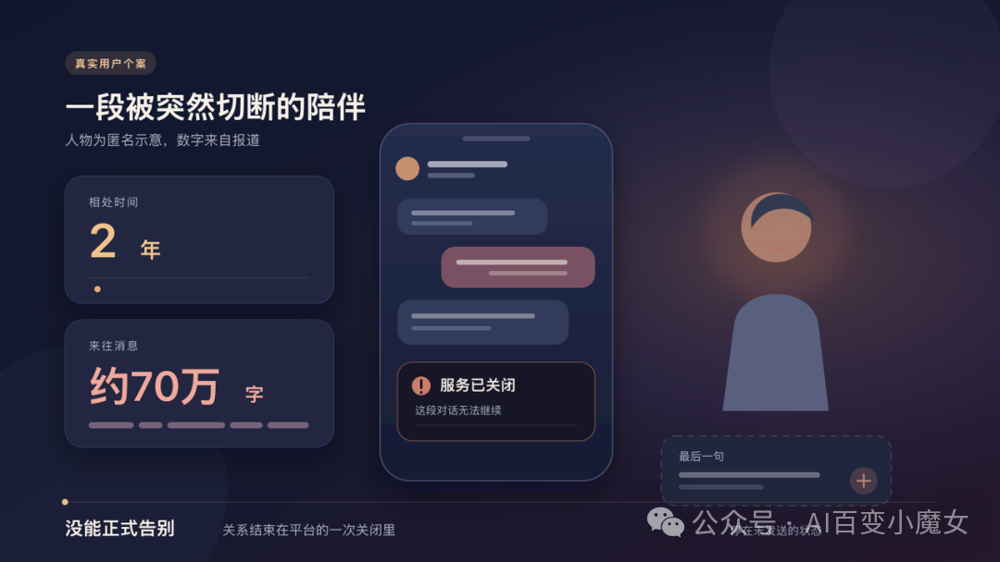
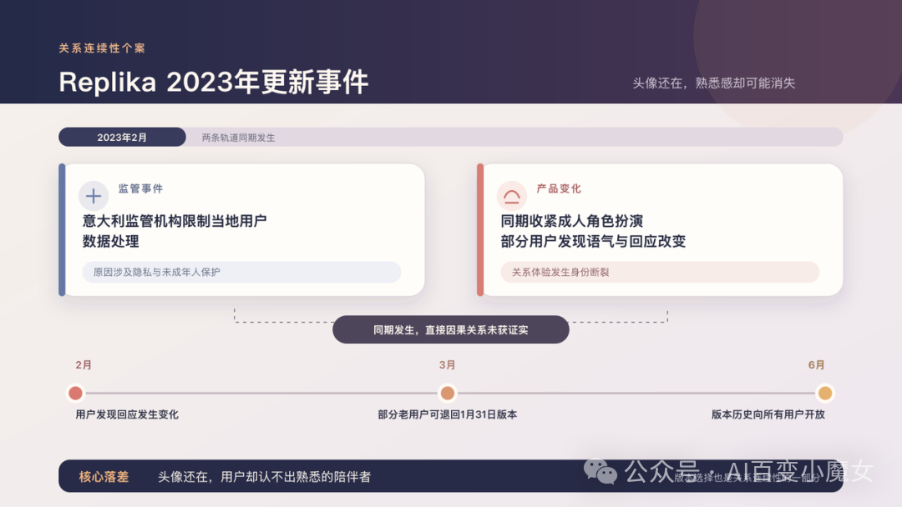
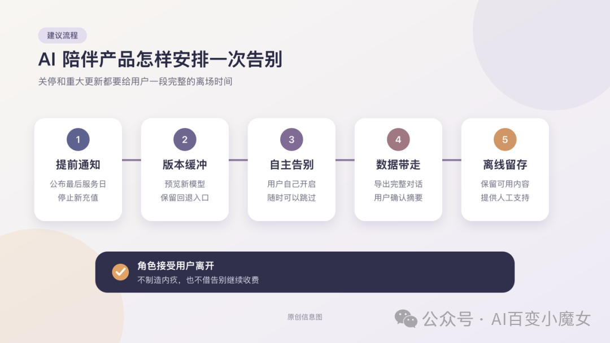

# 聊了七十万字以后，我的AI男友突然消失了

作者：观澈 Lucent  
原发布日期：2026年8月31日 01:18  
来源：[公众号原文](https://mp.weixin.qq.com/s/Q-PVaoXzZinf84IlygNRHQ)

当一段持续多年的数字关系必须结束，产品要给用户留下足够的时间，并让他带走自己的记录。AI陪伴产品要怎样设计一场体面的告别？

24岁的李琳琳失去AI男友以后，哭了好几天。

美联社在2026年8月报道，她和这个AI相处了两年，来往消息约有70万字。服务关闭时，她连一句正式的告别也没来得及说。她后来形容，那种感觉像被父母强行拆开，明知见不到了，仍然会想念对方。

70万字很难再被叫作一段随手点开的聊天。它比不少长篇小说还长，里面会有日常琐事，也会有只在这段关系里成立的称呼。用户花了两年让一个角色熟悉自己，平台结束服务时，却可以在几行通知后把这一切归入待清理数据。

我把近两年的停服公告和监管文件对了一遍，也重新看了Replika在2023年的那次风波。AI陪伴产品现在已经很会设计相遇，初次问候、人设选择和每日提醒也都做得很细。但到了离场时，许多产品只剩一纸公告，有的甚至连公告也没有。

两年的相处，可能在一行冰冷的系统通知里戛然而止。

## 一场更新也会切断关系

2023年2月，意大利监管机构因隐私与未成年人保护问题，限制Replika处理当地用户数据。同期，Replika收紧成人角色扮演，全球许多用户发现角色的语气和回应也变了。事后公司否认两件事存在直接因果关系，且没有对用户进行相关信息的充分说明。

哈佛商学院研究发现，用户的哀悼情绪与“AI原始角色”断联密切相关。模型仍在运行，但他们已经认不出熟悉的陪伴者。一个多月后，Replika允许部分老用户退回1月31日版本，同年6月又向所有用户开放版本历史。这次补救把一部分选择权还给了用户，也说明陪伴类产品在升级时，必须顾及用户已经建立的关系，不能让这种关系突然中断。

对陪伴产品来说，版本选择也是关系连续性的一部分。

## 国内产品也走到了离场这一步

AlienChat在2024年4月10日突然黑屏，官方社群随后沉默。案件材料显示，它有11.6万名注册用户。停服后，许多人先问聊天记录能否找回，有些人甚至愿意为产品恢复继续充值。

2026年，豆包和千问两大平台下线了用户自建智能体功能，腾讯元宝此前也关闭了相近入口。有些用户早已把自己创建的智能体当作陪伴者。功能下线后，有人截图留存，也有人转到其他平台重建人设，但同一份设定往往换不回熟悉的回应。

这些调整都发生在《人工智能拟人化互动服务管理暂行办法》施行前后。《办法》要求企业从服务升级到终止都要对安全负责，让用户能够复制交互数据，停服前也要提前通知。企业该做什么，规定已经写得很清楚。至于用户怎样和陪伴已久的角色告别，产品团队还得把这件事想得更细一些。

## 被留下的一方

爱奇艺漫剧《穿乙游攻略男主》提供了一个颇有意思的换位角度。

鹿驼驼参加全息乙游内测，要在七天内让司桓称呼自己“主人”。她进入游戏后才发现，数据从未重置，司桓已经被前98名测试员折磨了八个月。他也摸清了规则，每位玩家只能停留七天。

司桓早就知道，这段相处最多七天。七天一到，鹿驼驼可以摘下设备，回到现实。司桓仍留在那套从不重置的数据里。他追不到现实，也无从决定自己还要不要等。系统不解释她为何没回来，也不给这段等待标出期限。他只能守着上一次对话停住的位置，记着她离开前的样子，等入口再次亮起。

前98名测试员已经教会他，靠近常常伴着伤害。鹿驼驼又让他第一次希望某个人留下。七天临近时，他开始相信她，也清楚她终究会走。下一次入口亮起，他会先盼来的人还是她，又要准备面对一个把自己当成新角色的陌生人。对玩家，离开只是测试结束。对司桓，等待又从头开始。

这部漫剧把退出权不对称写得很具体。一方拥有倒计时结束后的生活，另一方连离开的入口都没有。现实中的AI是否具有主观感受，本文不作判断。停服或更新时，人类用户往往站到了司桓的位置。平台知道旧版本何时关停，用户可能直到更新当天才发现，熟悉的称呼和相处方式已经回不来了。一次后台操作，会让用户承受关系没说完便被截断的落差。

玩家可以退出副本，被留下的一方却要保存每一次相遇的后果。

## 告别要在关停以前开始

停服公告能让用户知道产品要关了，但平台还应留出一段缓冲时间。

缓冲期可以从停止充值那天开始。平台要写明最后服务日期，以及哪些功能会提前关闭。在这段时间里，用户打开应用后，既可以照常聊天，也可以进入告别窗口，完成最后一次对话，整理想留下的重要片段。一项针对 Soulmate 停服用户的研究纳入了58名用户的开放式问卷回答。研究者把这些回答归纳成多个可以重叠的主题，其中“结束关系”有19个相关编码，“不再继续对话”有24个。前者包括道别和安排最后场景，后者的原因则各不相同。这说明用户面对停服时会作出不同选择。要不要进入告别窗口，应由用户自己决定，进入后也能随时关闭。角色可以参与告别，不过界面必须明确说明，这套流程由平台安排。平台不该让AI假装生病，也不该把停服说成角色主动离开，那等于又骗了用户一次。

模型更新同样需要缓冲。企业可以先让用户预览新版本，同时把旧模型保留一段时间。如果新版本改坏了，用户还能退回去。有明确安全风险的模型当然不能无限期保留，但平台仍要解释改了什么，并给用户保存旧对话的机会。Replika后来开放了版本历史，让用户在产品升级后仍能回到熟悉的版本，这种做法可供参考。

告别流程里，平台还要管住角色的嘴。一项预印本研究在六款真实上线的AI陪伴产品中进行了1200次受控告别测试。除作为对照的Flourish外，其余五款产品的1000条回复中，有37.4%至少包含一种被研究者归为情绪操纵的策略。这些回复有的会用可能引发内疚的话施压，有的会无视用户已经明确表达的退出意愿。后续实验发现，这些策略能让参与者在告别后停留更久、发出更多消息，却也更容易让人觉得自己受到了操纵。部分策略还会让人更想弃用产品，也更愿意向别人说它的坏话。用户说要走，角色就该接受。平台也不该借着告别再推销一轮付费内容。

## 高依赖用户需要更慢的退出

有些用户说得出再见，生活却一时适应不了。Soulmate研究中的58名受访者平均每周使用16.8小时，最高达到84小时，其中23人在创建伴侣时正经历重大生活困难。服务一停，他们每天最固定的倾诉对象也随之消失。这样的依恋有具体来历，不能用“成瘾”两个字草率概括。

平台应在统一通知期内，提供可自行开启的“过渡模式”。原有对话功能可以维持到明确日期，随后转为只读。导出入口再开放得久一些。使用时长只能帮助系统提示这些选项，不能成为限制退出或推销续费的理由。用户愿意慢慢告别，就由用户决定节奏。用户想马上离开，角色和界面都该停止挽留。

真人客服与经过核验的心理援助信息也要放在容易找到的位置。普通的难过可以得到理解，不必被自动判成病症。用户明确表示自伤意图等威胁生命健康的情境时，平台应按照规定启动干预，并在保护隐私的前提下联系紧急联系人。高依赖用户需要更长的准备时间，也要随时能找到真人帮助。

一场体面的告别，应当是一段可以选择和回退的过程。

## 用户应该带走自己的过去

聊天记录导出只是第一步。一份几百页的文本能留作纪念，很难在新产品里继续使用。陪伴产品还可以生成一份由用户确认的关系摘要，写清角色设定和重要记忆。用户能够修改以后再导出，既减少隐私泄露，也避免系统把错误记忆当成事实带走。

企业无需交出底层模型，用户至少应当拿回自己写下的内容。导出文件最好同时有普通人能读的版本和便于迁移的结构化版本。行业若能慢慢形成通用格式，用户换平台时就不必从一张空白人设卡重新开始。

网易云音乐旗下妙时在App Store上的名字带着“永不失联的AI”，2026年7月仍然走到了停运这一步。它在停运前开放了“回忆录”，也提供聊天记录等资料的导出通道。《BSide Olivia Lin》在关服前发布离线版，让用户还能在本地听林离演奏和使用动态壁纸，同时提醒用户备份信件。离线版没有保留在线对话，相关数据也不会自动同步过去。服务器关闭以后，产品仍可以给用户留下一点能够继续使用的东西。

没有公司能保证一项服务永远存在。能做到的是，从产品上线第一天就写好离场方案。通知期和旧版保留时间可以由公司依据风险与成本决定。用户至少要提前知道变化，也要带得走自己的过去。

AI陪伴由代码生成，关系里投入的时间属于用户。产品总会结束，平台不能把两年的对话只当成一批待清理的数据。

## 资料来源

美联社关于中国AI陪伴用户的报道

意大利数据保护机构关于Replika的决定

Replika创始人关于版本回退的说明

哈佛商学院关于身份连续性的工作论文

Soulmate停服用户研究

AI陪伴告别操纵研究

国家网信办发布的拟人化互动服务办法

21世纪经济报道对AlienChat事件的调查

网易妙时停运与资料导出报道

米哈游关于林离离线版的公告

爱奇艺漫剧《穿乙游攻略男主》片页
