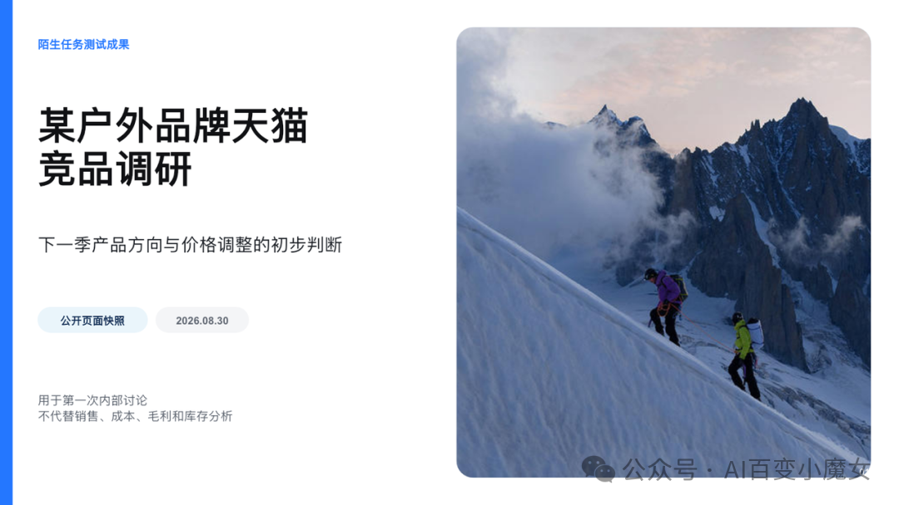
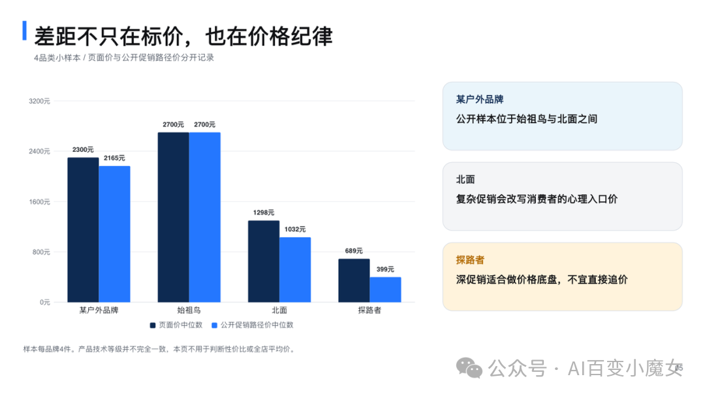
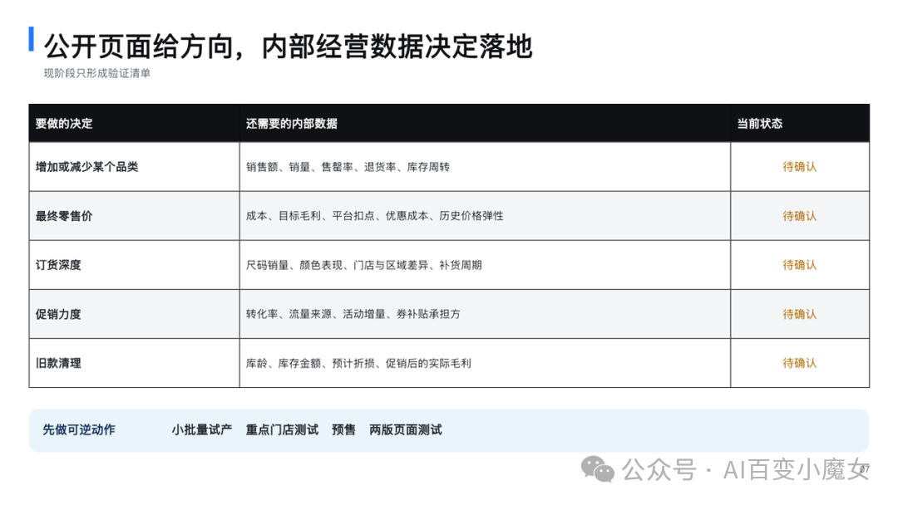
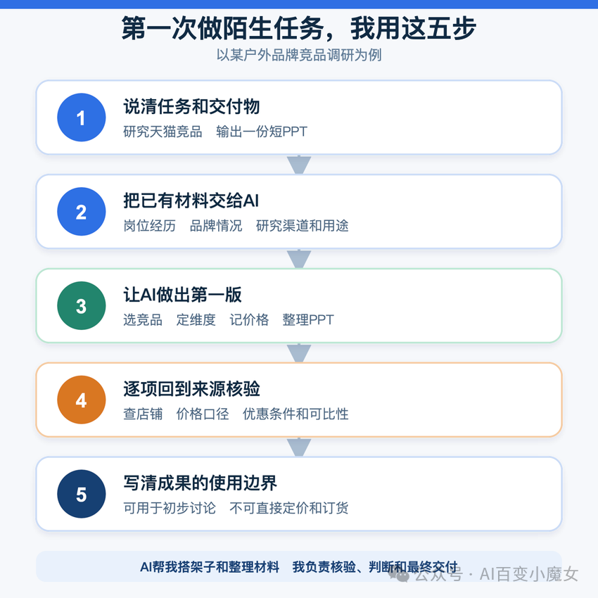

# AI让普通上班族开始做原本不会做的工作

作者：观澈 Lucent  
原发布日期：2026年8月31日 01:18  
来源：[公众号原文](https://mp.weixin.qq.com/s/qnpocnbd1t_YwsRIF8NK3Q)

我在OpenAI一份分析超过八十万条美国ChatGPT用户工作相关消息的报告里，停在了43.5%这个数字上。

研究人员先把写作、总结和排期等活动归为通用任务。去掉这些活动后，在其余职业特定消息中，43.5%涉及发送者本职历史边界之外的任务。若以全部工作相关消息为分母，比例为16.8%。

统计单位是一条消息。43.5%不能解释为同等比例的上班族已经跨行，也不能证明任务已经做对。样本只覆盖八类岗位，不能代表全体劳动者。这些消息能说明，人们正在借AI尝试过去常由其他岗位处理的工作。

我在学习AI，也准备进入相关行业。这份报告让我更愿意相信，AI降低了一部分专业任务的起步和制作门槛。普通上班族可以借它做出数据分析、网页排查或材料整理的第一版。最后能否交付，仍取决于业务知识、核验能力和责任判断。

## 离问题最近的人可以先做一版

难在开始。

报告举了两个例子。销售开始查看客户数据，营销人员开始排查网站问题。分析师和技术人员仍负责专业判断，需求方却能先让AI解释字段、整理报错和复现步骤，把模糊问题变成可检查的材料。

工作空间席位较少时，这类消息略多。在消息量处于中间50%的用户中，以全部工作相关消息为分母，2至5席位工作空间的跨职业消息占18.9%，101席位以上为16.3%。席位数不等于公司人数，这组差异也不能证明团队规模造成了跨岗位工作。它只能提示，缺少专门人员时，员工可能更常先向AI求助。

## 新人先拿到一种基本做法

一项客服研究跟踪了某软件公司五千多名员工和约三百万次对话。AI助手上线后，每小时成功解决的问题数平均提高15%，提升主要集中在经验较少和原先表现较弱的员工。入职两个月并使用AI的员工，表现接近没有AI、工作六个月以上的同事。

研究还发现，原先表现较弱和较强员工的对话文本相似度有所上升，不过这只是一项提示性证据。AI可能把优秀员工积累的部分做法变成新人随时取得的建议，让人更快知道陌生任务从哪里开始。产品和客户一直在变化，新人仍要判断建议是否适用于眼前情况。

## 我拿竞品调研做了一次测试

我在一家户外运动服装品牌公司做运营。平时跟踪门店销售、库存和缺货，根据情况安排调拨、补货和退仓，也会制作日报、周报和库存表。竞品调研超出了我过去熟悉的范围。

这次任务要研究某户外品牌，主要观察天猫旗舰店，最后做成一份简短PPT，为下一季产品方向和价格调整提供初步参考。动手前，我不知道该选哪些竞品，也不清楚冲锋衣、软壳、保暖层和户外裤应该怎样比较。页面标价与各种优惠价混在一起，我连统一的记录办法都没有。

我把自己的岗位、实际工作内容、研究渠道和报告用途交给AI，也说明最终要用短PPT展示。AI先把任务拆成产品方向、公开价格位置和决策边界。在参照品牌中，始祖鸟用于观察专业技术产品的价格上限，北面提供国际主流参照，国产大众价位则看探路者。

商品样本被分成硬壳、软壳或中层、保暖层和户外裤。AI把页面可见价与公开促销路径价分开记录，又用品牌官网和官方微商城交叉核对某户外品牌的样本。有了这副架子，我可以按顺序选品牌和品类，记录价格并核对来源，最后整理进PPT。

错也来了。天猫商品区被登录层挡住，AI无法读取登录后的个性化价格。搜索结果还把探路者和名称相近的拓路者混在一起，我核对店铺名称后才删掉错误样本。

优惠价格带来另一层麻烦。会员、淘礼金和凑单券都会改变到手价，不同尺码也可能价格不同。报告只能把页面价与促销路径价分开，并注明优惠条件。专业三层硬壳、城市冲锋衣和三合一产品也不能直接横比，比较时要保持用途与技术等级接近。

每个品牌只取四个服装样本，这张图只能观察价格排列，不能代表全店均价

最后得到的是一份八页PPT。它能说明竞品选择逻辑和公开价格位置，也能指出下一轮需要向公司索取哪些数据。它还不足以决定最终零售价、订货数量或促销力度。公开页面没有真实成本、目标毛利和库存压力，这些问题要回到内部数据里判断。

我仍然没有成为竞品研究人员。AI的帮助停在一项陌生工作的第一版。以前我不知道从哪里开始，现在至少有了一份可以讨论和检查、还能继续修改的成果。

## 写得完整和答得正确之间有距离

一项针对758名咨询顾问的随机实验测出了这种距离。其中385人处理18项处在当时GPT-4能力范围内的任务。使用AI的人完成得更多，平均快25.1%，成果质量评分高出30%以上。另有373人处理一项刻意放在能力边界之外的品牌战略题。无AI组的正确率为84.5%，GPT-4组为70.6%，GPT-4加提示方法概览组为60%。

AI组更常得出错误结论，表达质量反而更高。研究只测试了一项边界外任务，结论不能扩大到所有专业工作。它提醒我，完整格式和肯定语气都不能代替事实。我的价格表即使混入错误品牌，仍然会很整齐。缺少优惠条件的数字也照样能画成图。

数字要回到原始页面核对。合同和财务等高风险内容应交给专业人员复核，对外材料由本人确认。公司敏感信息也不能输入未经许可的工具。

公开页面可以提供验证方向，最终决策仍要回到销售、成本和库存数据

## 入门岗位也在受到挤压

AI让新人更容易做初级任务，公司留给新人练习的部分工作也可能减少。

斯坦福数字经济实验室在2026年8月修订的一项就业研究使用ADP匿名工资记录，覆盖持续观测企业中每月约三百五十万至五百万名全职劳动者。研究者以AI暴露较低的三组职业为参照，估算出截至2026年6月，22至25岁劳动者在暴露最高两组职业中的实际就业水平，比保持同速增长时低约19%。差距主要来自招聘减少，经验较多的劳动者没有出现相同变化。

这是一项描述性研究。高AI暴露指职业任务可能受到影响，不代表企业已经使用AI。教育结构和疫情后的行业调整也可能影响结果。样本总体就业仍在增长，也没有出现全经济范围的广泛岗位替代信号。对准备进入新行业的人来说，学习AI仍要落到一个能独立完成并经过核验的结果上。

## 我用这五步开始一项陌生工作

下面这套方法来自我的竞品调研测试。它更适合公开资料充足、做错后容易修改的低风险任务。

说清任务和交付物我先确定要研究天猫竞品，目标是为下一季产品和价格调整提供参考，交付物是一份短PPT。

提供自己已经掌握的材料我把岗位经历、日常工作、品牌情况、研究渠道和报告用途交给AI。这些材料让它知道我会什么，也知道报告要解决什么问题。

让AI拆解任务并做出第一版AI帮助我选择参照品牌，确定品类与价格记录方法，再把公开信息整理成表格、图表和页面。

逐项回到来源核验我检查店铺名称、价格口径、优惠条件和产品可比性。遇到读不到的页面或来源冲突，就删掉样本或标明限制。

写清成果能用到哪里这份PPT可用于内部初步讨论，不能直接决定定价和订货。涉及成本、毛利和库存的部分，仍要结合公司内部数据判断。

先选一件低风险、出错后容易撤回的小事，照这五步做一遍。把材料、错误和修改过程留下来。第二次再遇到，你已经知道该怎样开始，也知道走到哪里必须停下来找人。
