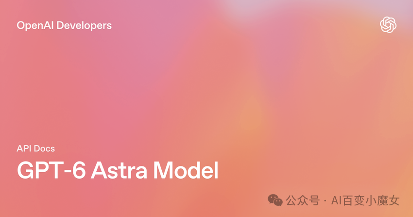
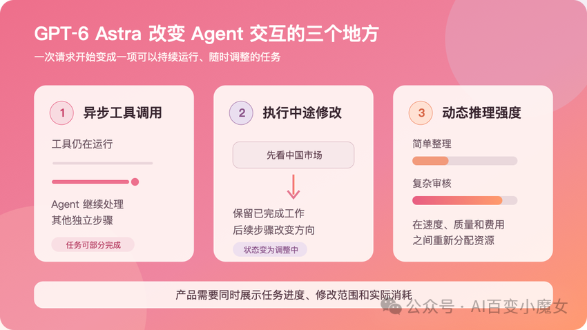

# GPT 崩了，GPT‑6 Astra 也来了，Agent 终于能边干边改需求

作者：观澈 Lucent  
原发布日期：2026年9月7日 22:20  
来源：[公众号原文](https://mp.weixin.qq.com/s/DArCblPtSGmfviATngRggA)

9 月 3 日，GPT 一度出现服务异常。同一天，OpenAI 发布 GPT‑6 Astra。两件事之间没有已经公开的因果关系，却把一个以前不太显眼的问题摆到了用户面前。一个 Agent 干到一半，页面打不开了，后台的工具到底停没停？

看到这两个消息前后脚出现，很难不把它们放在一起看。

目前没有公开信息能证明这次故障与新模型上线有关，把两件事直接画上等号并不严谨。不过这个时间上的巧合，恰好替 Astra 的几项新能力出了一道题。

如果聊天机器人只是回答问题，服务中断后，用户通常还能等恢复了再问一遍。但 Agent 会替用户查资料、跑代码，甚至操作其他软件。一旦服务中断，用户就很难判断任务的实际进度。页面虽然打不开，后台可能还在执行；重新发起任务，又可能重复之前的工作，产生额外费用。因此，服务恢复后，产品需要先告诉用户任务做到了哪一步、哪些操作还在继续，让他决定是接着做，还是重新开始。

我先看了 Astra 的模型页。105 万 token 的上下文、标准 API 基础价格为每百万输入 token 10 美元、输出 token 50 美元，这些数字很抢眼。继续读开发文档时，我更在意另外三处更新。异步工具调用让 Agent 不必守着一个慢工具，中途干预允许用户在执行时补要求，configuration_update 又能在后续响应里改变推理强度。

这几项更新让我更关心 Agent 产品该怎么设计。任务执行过程中，用户可以补充要求，Agent 再据此调整后续工作。但同时应用也需要把进度交代清楚，让用户知道已经完成了什么、哪些操作还在运行，以及新要求从哪一步开始生效。

想象一份普通的公司调研。Agent 已经在找财报、读新闻，做到一半，用户发现范围写错了，补了一句“先看中国市场”。如果应用只允许等旧任务做完，或者停掉以后重新提交，用户就得承担等待和重复工作的代价。能否保留已经查到的资料，取决于应用怎样保存任务进度。

Astra 在 Responses API 中提供了中途接收新要求的机制，让后续响应沿着修改后的方向继续。开发者可以通过 Astra 的 API，在任务执行过程中传入用户的新要求。不过，哪些已有成果可以沿用、哪些步骤需要重做，还需要应用结合任务进度来处理。

我认为，中途干预是三项更新里最值得产品经理留意的一项。异步工具主要改变执行效率，中途干预改变了人和 Agent 怎样一起做事。用户不再只负责下命令和收结果，他开始参与执行。用户提出新要求后，Agent 可以调整后续工作，但已经开始的工具调用未必会随之停止，需要应用另行取消。对于已经发出的邮件等已完成操作，中途修改要求也不会自动撤销它们。

## 工具不用等，但应用要记更多事

普通的工具调用会让模型停下来等结果。查天气只有几秒，停一下没有太大影响。但如果换成抓取几十份财报、运行一段代码，或者等待企业系统回传数据，整个任务可能被一个慢步骤拖住。

Astra 允许开发者把函数或自定义工具设置为 async: true。模型发出调用以后，可以先处理别的内容。工具执行完，应用再用原来的 call_id 把结果接回任务。

官方文档在这里专门提醒了一句。工具仍由开发者的应用执行，OpenAI 不会替应用接管后台任务。这个限制很关键。虽然异步工具省掉了模型干等的时间，但开发者仍需要处理工具排队、执行超时和取消请求，并在工具执行失败后安排重试或恢复。虽然界面没有必要把所有技术日志倒给用户，但至少应当让人看懂 Agent 正在做什么，以及他现在离开页面会不会影响任务。当服务异常时，这套记录会显得更重要。

## “收到修改”和“修改已经生效”是两回事

中途干预通过 Responses API 的 WebSocket 连接完成。响应还没有结束时，用户可以补充条件，也可以改变方向。

公司调研做到海外市场时，用户临时要求先看中国公司。系统接到这句话以后，可以调整后面的工作，不用等整轮任务结束再开一轮。

这里最容易误解的是“接到”。OpenAI 的文档写得很明确，response.steer.accepted 只代表新要求已经排队，不代表模型已经照着它行动。服务器会先完成当前输出项和已经运行的托管工具，再衔接包含新要求的后续响应。如果还缺少工具结果或审批，则需要应用先补齐。

因此，我觉得产品必须把“已收到”和“已生效”分开。用户发出新要求，界面先告诉他系统收到了；任务真正转向以后，再标出修改从哪一步开始。少了这层反馈，用户看到输入框能打字，很容易以为刚才的所有工作已经立即改道。

还有一些动作根本不能改道。文档同样说明，中途干预不会重写已经返回的内容，也不会撤销早先的动作或取消已经启动的工具。调研任务中，修改要求可能带来重复检索和分析；涉及发邮件、付款或删除文件时，还可能产生难以撤回的外部影响。我认为，产品应该在发邮件、付款或删除文件之前，让用户确认是否执行。中途干预可以调整后续计划，但已经完成的操作，仍需要单独的撤销或补救机制。

中途干预让用户能够参与任务的执行，在过程中补充条件、调整方向。相比异步工具减少等待，这种协作方式的变化更值得产品经理关注。产品也需要记录每次修改的影响，让用户知道哪些成果可以沿用、哪些步骤需要重做，避免重复执行带来额外的时间和费用。

### Claude 和 Gemini 怎样处理执行中的修改

| 比较范围 | GPT‑6 Astra Responses API · WebSocket | Claude Managed Agents 托管服务 | Gemini Live API 实时对话 |
| --- | --- | --- | --- |
| 怎样提出修改 | 执行中发送新要求 response.steer | 先发中断指令，再发新要求 user.interrupt → user.message | 用户开口打断 语音活动检测（VAD）触发 |
| 接下来怎样执行 | 新要求先排队 → 完成当前输出项及已运行的托管工具 → 衔接后续响应* | 中断当前轮次 → 在同一会话中 按新要求开启下一轮 | 取消当前生成 → 接收用户新输入 → 继续实时对话 |
| 何时算生效 | “已接收”只表示排队 需观察后续响应是否应用修改 | 生成中的模型响应会停止 工具运行时，中断处理可能延迟 | 检测到打断后取消生成 向客户端发送中断通知 |
| 已有内容怎么办 | 已返回内容不会被重写 成果是否沿用由任务流程处理 | 在同一会话中继续 开启新一轮不等于整项任务重做 | 已发给客户端的内容 保留在会话历史中 |
| 正在运行的工具 | 中途修改不会自动取消 已启动的工具 | 工具可能影响中断生效时间 不能把“已发指令”当作“已停止” | 服务端通知取消的工具调用 ID 应用仍需处理外部执行状态 |
| 官方依据 | Astra 中途干预文档 | Claude 会话事件文档 | Gemini 实时打断文档 |

把三家的官方文档放在一起看，会发现执行中改要求已经可以通过不同方式来实现。

Claude 的 Managed Agents 提供了会话级的事件接口。开发者可以先发送 user.interrupt，再用 user.message 补充新要求，让同一会话进入下一轮工作。中断事件也有排队和实际处理的区别，工具正在执行时，中断可能要晚一些才生效。这里比较的是 Anthropic 的托管 Agent 服务。中断后，Agent 会在同一个会话中根据新要求开启下一轮工作，开启新一轮并不意味着整项任务必须从头重做。官方说明

Gemini 的 Live API 则提供了实时对话中的打断机制。用户开口时，可以取消当前生成，已经发给客户端的信息仍保留在会话历史里。在支持异步函数调用的模型上，工具还可以设为 NON_BLOCKING，让对话在等待工具时继续。不过这项能力受版本限制，文档明确列出 Gemini 3.1 Flash Live 暂不支持异步函数调用。这些是 Live API 的能力，不能直接算到 Gemini 3.8 Flash 的普通文本调用上。实时打断说明和工具调用说明

这几份文档谈的场景不同，不能据此给三家排出高低。但它们至少说明，中途协作已经有多种接口方案。Astra 值得关注的地方，是把修改的接收、等待和后续响应衔接明确放进了 Responses API。产品可以据此告诉用户，新要求到了哪一步。至于能省下多少返工，接口说明还给不出答案。

我更关心改完要求以后，已经做对的部分能留下多少。沿用前面的公司调研场景，假设前两家已经整理完，用户这时改成“只保留中国公司，并增加定价信息”。哪怕聊天窗口很快回复了“收到”，后台仍在重复查同一份资料，用户也没有因此少等。对我来说，保住有效成果、让不再需要的工作及时停下，比输入框在执行时能不能打字更值得检查。

## 推理强度不该变成五个按钮

Astra 支持 low、medium、high、xhigh 和 max 五档推理强度。在标准单 Agent 模式下，也就是由一个 Agent 推进任务时，开发者可以通过 configuration_update（配置更新），在两次响应之间调整推理强度。新的设置从下一次响应开始生效，并持续沿用，直到开发者再次修改。正在生成的响应不会因此立即改变。

这让开发者可以按工作需要分配推理资源。例如，整理公司名单时使用较低强度，分析复杂财务数据时再调高，最后统一报告格式时降下来。这些调整需要应用安排，并不意味着模型会自动在不同阶段切换档位。

不过，开发者能精细设置，不代表用户也需要理解五个档位。普通用户很难仅凭 high 和 xhigh，判断哪一个更适合眼前的任务。

我更倾向于让应用先根据任务选择合适的强度，在耗时或费用预计会明显增加时，再让用户决定是否继续深入分析。界面可以提供“快速处理”和“深入分析”等容易理解的选项，并说明各自适合什么工作。这样，用户选择的是自己需要的处理方式，不必先学会模型的参数名称。

## Agent 能继续做，应用还得把进度说清楚

读完这几份文档，我更关心应用怎样处理这些能力带来的变化。多个步骤同时运行、用户中途修改要求，都会让任务进度和费用变得更难判断。我希望应用能在每次修改后，告诉用户哪些成果可以沿用、哪些步骤需要重做。如果还有工具暂时停不下来，或者后续工作预计会增加费用，也应当说明，让用户有依据决定继续执行，还是先停下来检查已有结果。
